# 👋 ¡Hola, soy Máximo JM Hidalgo! 💻

 

**[ES]** Hola, soy Máximo Hidalgo, programador, desarrollador y estudiante de Ingeniería en Sistemas en la Universidad Tecnológica Nacional de Buenos Aires (UTN - FRBA). Actualmente me dedico a construir proyectos robustos, bien documentados y eficientes, con un fuerte enfoque en el backend y la arquitectura hexagonal. Desde el desarrollo de sistemas operativos en **C/C++**, hasta el despliegue de soluciones completas de proyectos utilizando **Java**, **Docker**, Bases de Datos y colas de mensajería como **RabbitMQ**. Disfruto desarrollando mis ideas a través de las herramientas que me da el código para expresarme.

**[EN]** Hi, I'm Máximo Hidalgo, a programmer, developer, and Information Systems Engineering student at the National Technological University of Buenos Aires (UTN - FRBA). I currently focus on building robust, well-documented, and efficient projects, with a strong emphasis on backend and hexagonal architecture. From developing operating systems in **C/C++**, to deploying complete solutions using **Java**, **Docker**, Databases, and message brokers like **RabbitMQ**. I enjoy bringing my ideas to life through the tools that code provides to express myself.

 

## 🛠️ Tecnologías y Herramientas

  <table>
    <tr>
      <td align="center" width="33%">
        <b>💻 Lenguajes Core</b>  
          
         
        
      </td>
      <td align="center" width="33%">
        <b>🐳 Infraestructura & BD</b>  
          
        
      </td>
      <td align="center" width="33%">
        <b>🧰 Web & Tools</b>  
          
         
        
      </td>
    </tr>
  </table>

 

## 🚀 Proyectos Destacados
Aún estoy estructurando mis repositorios públicos, ¡pero muy pronto vas a poder ver acá mis proyectos más interesantes (incluyendo desarrollos de sistemas distribuidos y arquitecturas complejas)!
 

## 🎯 Current Missions
- 🎓 **UTN-FRBA**: Avanzando en mi carrera universitaria como futuro Ingeniero en Sistemas de Información.
- ☁️ **Hobbies**: Desarrollando mi creatividad en proyectos de programación personales vinculados al Gaming.
- 📜 **Certificación**: Cursando *Desarrollo Web Completo (HTML5, CSS3, JS, AJAX, PHP y MySQL)* en Udemy.
- 💼 **Laboral**: En búsqueda activa de nuevos desafíos técnicos y oportunidades para seguir escalando en mi carrera profesional.

 

## 🤝 Conectemos

 

## 📊 Nivel de Atributos & Estadísticas (Auto-Update)

  
  

---

  <i>Si hay un muro, lo hacemos pedazos, y si no hay ningún camino, ¡lo abrimos con nuestras propias manos! 💥</i>

